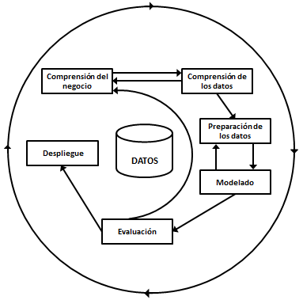

```{r setup, include=FALSE}
knitr::opts_chunk$set(echo = TRUE)
```

## Comprensión de negocio

### Antecedentes

Cada vez más empresas recaban información de sus procesos con el proposito de mejorar sus estrategias comerciales. En el caso de los supermercados, es muy importante conocer el tipo de clientes y el tipo de compras que realizan para poder mejorar el servicio al cliente, el atractivo de la marca y la competitividad de la empresa.

En este sentido, Walmart ha concentrado la información sobre compras realizadas por sus clientes en distintos viajes y con base en ello los ha categorizado de acuerdo a características en común. Por ejemplo, los clientes pueden hacer viajes de compra de la despensa semanal, viajes de compras muy especializadas (como el pago de servicios o la compra de medicamenteos), algún viaje de temporada (como comprar de disfraces y dulces para *Halloween*), entre otros.

### Determinación del objetivo

El reto del proyecto consta en poder recrear esta categorización con un acceso más limitado a los datos. Esto tiene el potencial de proponer nuevas y más robustas maneras de categorizar los viajes.

En este sentido, se proveen la base de datos train.csv que contiene la categorización. Con base en ella el proposito es predecir la categorización en la base de datos test.csv.


### Determinación de criterio de éxito

El principal reto del proyecto es superar el *accuracy* que se podría haber logrado con la base de datos sin preprocesar. En este sentido, utilizando el modelo......

### Plan del proyecto

Posterior a la comprensión de negocio y de acuerdo a la metodología CRISP-DM., para lograr el objetivo debemos en primer lugar hacer un análalsis exploratorio de los datos para lograr en la mayor medida posible una comprensión integral de estos. En segundo y tercer lugar, con base en la comprensión del negocio y de los datos, proponer transformaciones y evaluar el desempeño de distintos modelos. Mencionamos segundo y tercer lugar porque estos procesos los debemos realizar en conjunto. Una vez elegido las transformaciones y el modelo final procedemos a la etapa de evaluación en la que reentrenanermos el modelo con datos de entrenamiento y prueba con hiperparámetros optimizados para posteriormente subir el modelo a *kaggle*. Finalmente, para la parte de despliege se desarrollara un web service en flask para predecir resultados a partir de nuevos datos y un reporte ejecutivo.




## Comprensión de los datos (R - Bash)

Reporte reproducible de recolección de datos.
Análisis exploratorio de datos (reporte reproducible)
Univariado
Bivariado
Multivariado
 
 
 
 
## Preparación de los datos (R - Bash)

Reporte reproducible de selección e integración de datos
Reporte reproducible de limpieza de datos (incluyendo imputación)
Reporte reproducible de ingeniería de características
 
 
## Modelado (Python)

Diseño de prueba de modelo
Selección de modelo (benchmark de modelos seleccionados)
Ajuste de hiperparámetros óptimo
 
 
## Evaluación (Python)

Evaluación del modelo final contra el conjunto de prueba
Reentrenamiento final de modelo con datos de entrenamiento y prueba con hiperparámetros optimizados.
Generación y carga de datos de prueba en Kaggle (reporte de posición final en tablero)
 
 
## Implantación (Python)

Desarrollo de web service en flask para predecir resultados a partir de nuevos datos
Reporte ejecutivo final con principales hallazgos e hitos del proyecto (5 minutos)
