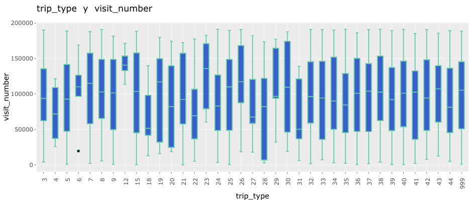
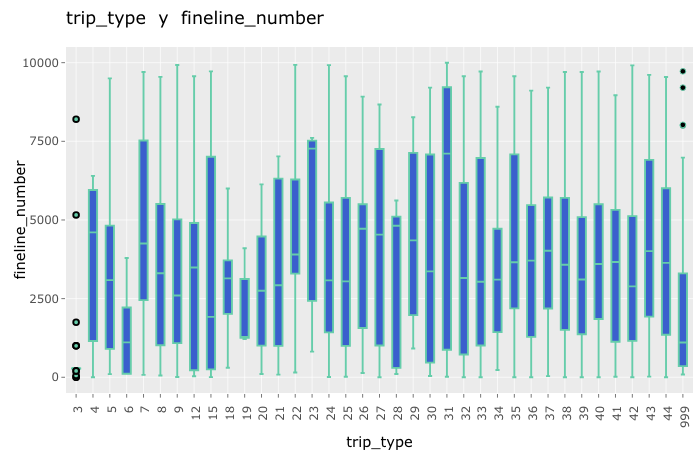

```{r}
# Cargamos paquetes 
library(tidyverse)
library(readr)
#library(index)
library(fastDummies)
library(ggthemes)
library("VIM")
```

```{r}
# Cargamos las funciones necasarias para la limpieza y el EDA
source("aux-R/Utils.R"     , encoding = 'UTF-8')
source("aux-R/00-load.R"   , encoding = 'UTF-8')
source("aux-R/01-prepare.R", encoding = 'UTF-8')
source("aux-R/02-clean.R"  , encoding = 'UTF-8')
source("aux-R/03-eda.R"    , encoding = 'UTF-8')
```

Una vez cargados los datos, se hace un primer análisis para detectar errores de carga o de lectura para después continuar el análisis gráfico.

```{r cars}
glimpse(walmart)
```

En la sección de data del concurso de Kaggle, se presenta una breve descripción de cada una de las columnas del conjunto de datos.

**TripType:** a categorical id representing the type of shopping trip the customer made. This is the ground truth that you are predicting. TripType_999 is an "other" category.

**VisitNumber:** an id corresponding to a single trip by a single customer

**Weekday:** the weekday of the trip

**Upc:** the UPC number of the product purchased

**ScanCount:** the number of the given item that was purchased. A negative value indicates a product return.

**DepartmentDescription:** a high-level description of the item's department

**FinelineNumber:** a more refined category for each of the products, created by Walmart


```{r pressure }
 head(walmart)
```
 
 El primer paso siempre es conocer el número de variables con las que se está trabajando y la cantidad de observaciones que se tienen tanto en el conjunto de entrenamiento como en el de prueba.
```{r}
dim(walmart)
```
```{r}
dim(walmart_test)
```

Entonces se tienen 647 054 observaciones de 7 variables en el conjunto de prueba y notamos que en conjunto de prueba es ligeramente más grande que el de entrenamiento con 653 646 observaciones.

Analicemos primero cuales observaciones tienen valores faltantes:
```{r}
summary(walmart)
```

```{r}
rows_with_NAs(walmart)
```
 y vemos que de las 647 054 observaciones del conjunto de entrenamiento, 4 129 tienen valores faltantes y todas las observaciones con valores faltantes presentan estos faltantes en las columnas UPC y FinelineNumber simultáneamente.
 
```{r}
prop_missings(walmart)
```

Y observamos que el porcentaje de observaciones con valores faltantes es de 0.064% de las observaciones. Lo que nos hace pensar en que al ser un porcentaje tan pequeño podríamos prescindir de ellos, sin embargo, al analizar los datos de prueba, notamos que también existen datos faltantes en las mismas variables y en la misma proporción en el conjunto de prueba.

```{r}
prop_missings(walmart_test)
```

Entonces, por el momento, decidimos quedarnos en estas observaciones incompletas pues creemos que pueden aportar información importante para la predicción de estos datos incompletos.

En adelante, nos enfocaremos sólo en el conjunto de entrenamiento.

Analicemos ahora cuántos valores únicos existen para cada una de las variables.

```{r}
unique_per_col(walmart)
```

Y vemos que para tener más de 600 mil observaciones, hay variables que tienen muy pocos valores únicos por lo que algunas de ellas deben de ser variables categóricas.

Observando más detenidamente el dataframe notamos que hay algunos valores en la columna de DepartmentDescription que tienen "NULL" como valor. Puede que esto se trate de un error que se dio al cambiar los datos de formato. Veamos cuantas observaciones presentan este problema:

```{r}
rows_with_string(walmart, walmart$DepartmentDescription, 'NULL')
```
Y parece que todas las observaciones con "NULL" en la columna de DepartmentDescription pertenecen al conjunto de observaciones que vimos donde tanto UPC como FinelineNumber son nulas.

Por otra parte, es obvio que hay variables que se leyeron como un tipo cuando en realidad son otro, por ejemplo los días de la semana que se guardaron como caracter pero en realidad son categóricas, entre otros.

Finalmente, los nombres de las columnas están bien pero por convención es mejor tenerlos en minúsculas y separados por un guión bajo '_'. 

Estos tres problemas anteriores se resolverán con una primera iteración de limpieza.

## Limpieza

Primero, pasamos a snake_case los nombres de las columnas y se los asignamos a su variable correspondiente.

```{r}
colnames(walmart) <- clean_colnames(walmart_colnames)
```

```{r}
head(walmart)
```

Ahora, transformemos los "NULL" de la columna de department_description a NA.
```{r}
walmart$department_description <- replace_NULLs(walmart$department_description)
```

y la proporcion de valores faltantes resulta ahora:
```{r}
prop_missings(walmart)
```

Así, ahora sabemos que del 0.064% que tiene faltantes en las columnas upc y fineline_number, el 0.021% también presenta valores faltantes en la columna de department_description.

Finalmente, asignemos el tipo de variable correcto a cada una de las columnas.
```{r}
walmart <- data_type_conv(walmart)
```

Checamos que se asignaron correctamente los tipos de datos:
```{r}
glimpse(walmart)
```

Por otra, analizando más de cerca la columna de department_description, notamos que hay un departamento con dos nombres "MENS WEAR" y "MENSWEAR", unifiquemos estos nombres.

```{r}
walmart <- walmart %>%
  mutate(department_description = str_replace(department_description, "MENS WEAR", "MENSWEAR"))
```

Y aplicamos este mismo proceso de limpieza al conjunto de prueba.

```{r}
colnames(walmart_test) <- colnames(walmart_test) %>% clean_colnames()
walmart_test$department_description <- replace_NULLs(walmart_test$department_description)
walmart_test <- data_type_conv(walmart_test)

walmart_test <- walmart_test %>%
  mutate(department_description = str_replace(department_description, "MENS WEAR", "MENSWEAR"))
```

Checamos el resultado:
```{r}
head(walmart_test)
```

 
## EDA univariado
Separemos las variables por categóricas y numéricas, pues los análisis gráficos de cada tipo de variable es diferente.

```{r}
walmart_num <- select_numeric(walmart)
walmart_cat <- select_categoric(walmart)
```

Ahora graficamos las distintas variables para detectar características importantes de cada una, comenzando por las variables numéricas.

```{r, warning=FALSE, fig.asp=.5}
plot_boxplot(walmart_num)
```

Inmediatamente notamos que tanto las variables de upc como scan_count tienen una alta dispersión y recordemos que upc es una de las variables que presentaba datos faltantes, por lo que más adelante en el proceso de limpieza no sería conveniente realizar una imputación por valores medios.

```{r, warning=FALSE, fig.asp=.4}
plot_density(walmart_num)
```
```{r, warning=FALSE, fig.asp=.4}
plot_histogram(walmart_num)
```

Tanto en las gráficas de densidad como en los histogramas se observan comportamientos en las variables que no se veían antes como que upc y scan_acount tienden a aglomerarse cerca de un valor, lo cual explica la alta dispersión que vimos en los boxplots. 

Por otra parte, visit_number parecería tener un cierto comportamiento periódico con un pico que se repite aproximadamene cada 50 000 valores

Continuemos con el EDA de las variables categóricas.

Para la variable department_description:

```{r, fig.asp=1.2}
plot_barplot(walmart, walmart$department_description) + theme_light(base_size = 9) +
  xlab("department_description")
```

Los productos comprados más frecuentemente son departamento de comestibles, seguidos por los de cuidado personal y las compras de impulso. Mientras que el menor número de ventas se realizan en los departamentos de auxiliares de salud y belleza y otros departamentos.

Para la variable trip_type:
```{r}
plot_barplot(walmart, walmart$trip_type) + xlab("trip_type")
```

El trip_type más común es el 40, seguido por el 39,37 y 38. Mientras que el menos común es el tipo 14.

Para la variable de weekday:
```{r}
plot_barplot(walmart, walmart$weekday) + xlab("weekday")
```

Los días más comunes para hacer compras son los fines de semana, en especial los domingos, lo cual es congruente con que la mayoría de las personas trabajan los días entre semana. Curiosamente, el día menos común para hacer las compras es el Jueves.

Para la variable de fineline_number, recordemos que a pesar de ser categórica, tenía 5196 posibles valores por lo que no sería recomendable hacer una gráfica de barras ya que sería poco informativa y difícil de visualizar. En su lugar obtendremos los 15 valores más frecuentes en esta columna.

```{r, fig.asp=.5, warning=FALSE}
names(sort(summary(walmart$fineline_number), decreasing=T)[1:25])
```

Recordemos que tenemos varias observaciones incompletas a las cuales les faltan dos o tres variables. Nos gustaría analizar más de cerca estas observaciones y ver si se comportan de la misma manera que las demás o si tienen alguna característica que las diferencie además de la incompletez.

Para las variables numéricas:
```{r}
walmart_NA <- rows_with_NAs(walmart)

plot_boxplot(walmart_NA)
```
Ahora sabemos que el número de productos comprados o devueltos en las observaciones con valores faltantes van de 0 a 6.

```{r}
plot_density(walmart_NA)
```
```{r}
plot_histogram(walmart_NA)
```

El comportamiento de visit_number y la aglomeración al rededor del 1 en scan_account son similares a los vistos en las observaciones completas.

Para las variables categóricas:
```{r}
plot_barplot(walmart_NA, walmart_NA$department_description) + xlab("department_description")
```

Así, encontramos una relación entre las observaciones con valores faltantes. Si la observación es incompleta, entonces es muy probable que la compra se haya realizado en el departamento de PHARMACY RX.

```{r}
plot_barplot(walmart_NA, walmart_NA$trip_type) + xlab("trip_type")
```

Nuevamente, vemos un cambio en el comportamiento de las observaciones incompletas. Ahora el trip_type más común por mucho es el tipo 5 seguido del 999 que representa otros.

```{r}
plot_barplot(walmart_NA, walmart_NA$weekday) + xlab("weekday")
```

La variación entre los días de la semana no parece tener un patrón definido en estas observaciones incompletas, pues la frecuencia de los días de la semana no varía considerablemente. Pero algo interesante es que para las completas el día más común era el domingo y este día en las incompletas resulta ser el penúltimo.

Y no podemos hacer un análisis de fineline_number pues todas las observaciones con NA's tienen valores faltantes en esta columna.

## EDA Bivariado

Correlación de las columnas con la variable de salida: 
 
Empezamos haciendo un análisis de correlación entre las variables numéricas. En particular, nos interesa destacar las variables que tienen una alta correlación positiva o negativa, con la variable trip_type, que es la variable a predecir.

```{r}

#Las variables numericas
walmart_numeric<-walmart %>% select(where(is.numeric))

## Correlacion entre variables numericas 
cor_matrix<-round(cor(walmart_numeric, use="complete.obs" ),2)

melted_walmart <- melt(cor_matrix)

heat_cor_numeric_walmart<-ggplot(data = melted_walmart, aes(x=Var1, y=Var2, fill=value)) + 
  geom_tile()+
  theme(axis.text.x = element_text(angle=90))

heat_cor_numeric_walmart

```

No se encuentran fuertes correlaciones entre las variables numéricas.

Ahora, realizamos un análisis entre variables categóricas, en particular entre trip_type, nuestra variable a predecir, y las otras variables categóricas. Sin emabrgo, es importante notar que existen más de 40 trip_types, por lo que la visualización puede ser difícil de analizar e interpretar.

Para la variable weekday:
```{r}
# stacked bar chart
ggplot(walmart, aes(x =trip_type   , fill =  weekday)) + 
  geom_bar(position = "stack") + coord_flip()
```

Para la variable scan_count:
```{r, warning=FALSE, fig.height=6}
ggplot(walmart, aes(x = scan_count    , fill =trip_type  )) + 
  geom_bar(position = "stack") + coord_flip() + xlim(-5, 10)
```

Para la variable department_description:
```{r, fig.width=15}
ggplot(walmart, aes(x = department_description, fill =trip_type  )) + 
  geom_bar(position = "stack") + coord_flip() + theme_light(base_size = 9)
```

Adicionalmente, se adjunta shinny app que contiene gráficos bivariados de variables numéricas y categóricas y de variables numéricas. A continuación se presentan algunas capturas de pantalla de las gráficas que se pueden generar en esta app.

```{r}

```

Abajo observamos una relación entre tipo de viaje y finleine_number. Esta variación es esperable dado que suponemos que habrá una relación entre el tipo de viaje y comprar productos de una categoría en particular. 
```{r}


```
Además, nos gustaría comprender un poco más la clasificación de los trip_types observando de manera más clara las relaciones que existen entre los trip_types y las department_descriptions.

```{r, fig.height=10, fig.width=8, message=FALSE}
plot_heatmap(walmart)
```

#Imputación
Como vimos antes la mayoría de las observaciones que contienen NAs en fineline_number y en upc, corresponden a compras realizadas en el departamento de PHARMACY RX, por lo que para las observaciones que presentan NAs en la columna de department_description se realizará la imputación de este valor. Tanto en el conjunto de entrenamiento como en el de prueba.

```{r}
walmart["department_description"][is.na(walmart["department_description"])] <- 'PHARMACY RX'
walmart_test["department_description"][is.na(walmart_test["department_description"])] <- 'PHARMACY RX'
```

Para finalizar el proceso de limpieza y recordando que el proceso de modelado y selección de modelos se realizará en python, se escriben archivos feather con nuestros data sets limpios.

```{r}
library(feather)
write_feather(walmart,"feathers/walmart.feather")
write_feather(walmart_test,"feathers/walmart_test.feather")
```


# Ingeniería de Características

Ahora, hacemos algunas manipulaciones a las columnas originales para facilitar el modelado posterior en python.

En esta primera parte se crean variables dummies a partir de la columna department_description. Aquí además de las variables dummies creamos las variables de compras o devoluciones por departamento y una columna donde indica si en esa visita se realizó una devolución o no. También creamos una variable donde se indica la cantidad total de productos que se compraron. Al crear estas variables, cambiamos el nivel de análisis, ahora cada observación corresponderá a un viaje a walmart, haciendo un data frame en versión wide.

Posteriormente, creamos la variable de variedad para después unirla al dataser original, esta variable indica en cuántos diferentes departamentos se realizó alguna compra o devolución por visita. Una vez que tenemos nuestra nueva columna de variedad, podemos agregarla al dataset original.

```{r}
source("04-to-wider.R"    , encoding = 'UTF-8')
```

Nuevamente, recordando que el modelado se hará en python, se pasan los datos a un formato feather.

```{r}
write_feather(walmart,"feathers/walmart_wider.feather")
```

